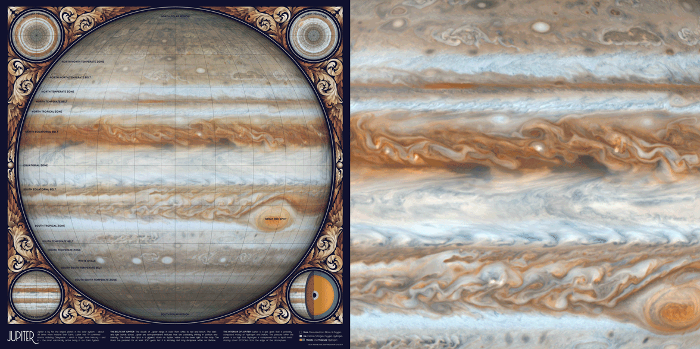
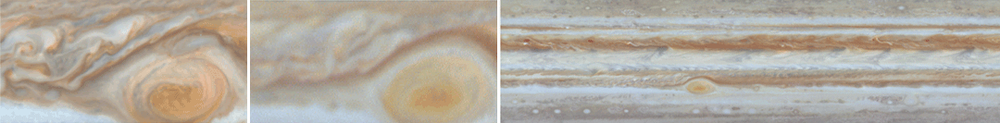

# An Animated Sketch of Jupiter

This repository explains how to make an animated sketch of Jupiter using open-source code and data from NASA. Software used includes `Python 3.7.1` and `Photoshop CC 2019`. If you have comments or suggestions for this tutorial, please let me know [on my blog](http://tabletopwhale.com/2019/08/02/an-animated-sketch-of-jupiter.html)!

**Python dependencies:** `matplotlib` `numpy` `pandas` `glob` `cartopy`. Dependencies can be installed with `pip install -r requirements.txt`.

## Special instructions for beginners

##### If you're new to coding:

[Software Carpentry](https://software-carpentry.org/) has great tutorials for [installing Python](https://carpentries.github.io/workshop-template/) (scroll down and follow the directions in  the Bash Shell and Python sections), [getting starting with Jupyter Notebooks](http://swcarpentry.github.io/python-novice-inflammation/setup/index.html), and [beginner-friendly Python programming](http://swcarpentry.github.io/python-novice-inflammation/aio/index.html). After you've installed Python using these tutorials, you can use [Git Desktop](https://desktop.github.com/) and the instructions in [this tutorial](https://help.github.com/en/desktop/contributing-to-projects/cloning-a-repository-from-github-desktop) to download the code and data in this tutorial.

##### If you're new to design:

You'll need software for editing raster and vector images ([this article](https://vector-conversions.com/vectorizing/raster_vs_vector.html) explains the difference). I use [Adobe Photoshop](https://www.adobe.com/products/photoshop.html) and [Illustrator](https://www.adobe.com/products/illustrator.html), but you can also use the free open-source programs [Gimp](https://www.gimp.org/downloads/) and [Inkscape](https://inkscape.org/release/inkscape-0.92.4/). There is no perfect software that fits everyone's needs, so you'll want to understand the pros and cons for the different [raster](https://www.colorexpertsbd.com/blog/brief-comparison-photoshop-gimp) and [vector](https://logosbynick.com/inkscape-vs-illustrator-vs-coreldraw/) programs before choosing.

## Table of Contents

1. [Gathering and processing data](#data)
2. [Map design in Python](#python)
3. [Map design in Illustrator and Photoshop](#illustrator_photoshop)
4. [References](#references)
5. [License](#license)

<a name="data"/>

## Gathering and processing data

#### Cassini images
This animation is the simplest map in the [Atlas of Space](http://tabletopwhale.com/2019/06/03/an-atlas-of-space.html) series, and only uses four different data sources. The first three images are high-resolution still images of Jupiter taken by Cassini in 2006. These images are available as a [North pole stereographic](https://photojournal.jpl.nasa.gov/catalog/PIA07783) map, [South pole stereographic](https://photojournal.jpl.nasa.gov/catalog/PIA07784) map, and as a [cylindrical map](https://photojournal.jpl.nasa.gov/catalog/PIA07782) of the entire planet.

Cassini also published [a video of Jupiter's clouds](https://photojournal.jpl.nasa.gov/catalog/PIA02863) in 2000, which I used to create the animation. The original video doesn't actually loop, and the time interval between frames isn't standardized. So it's important to note that this sketch is an artistic drawing rather than an accurate representation of the clouds in real time.

Cassini's video also doesn't include any data for the North or South poles, so the very top and bottom of this map aren't animated. You can probably see the discontinuity at about the second bolded latitude line (though it's not too noticeable because of the low wind speed near the poles).

<a name="python"/>

##  Map design in Python

The majority of the work was done in Photoshop, so the Python code is minimal. I used the code in this repository to convert the Cassini cylindrical maps into the Orthographic map projection (the original map is in the Plate Carrée projection).

<a name="illustrator_photoshop"/>

## Map design in Illustrator and Photoshop

After changing the projection of each map in Python, I used Photoshop to combine the high-resolution Cassini still images with the low-resolution video frames.

First, I edited the video frames to give the illusion of continuous flow by gradually fading the frames at the end of the movie. I've previously written a [detailed tutorial for animating in Photoshop](http://tabletopwhale.com/2014/11/03/how-to-make-an-animated-infographic.html), but you can also combine animation frames in many other programs (and even in Python itself).

I also removed the occasional shadowy blotches cast by Jupiter's moons using the `Clone Stamp Tool`. Finally, I edited the contrast in the video to match the background image using the `Image` --> `Adjustments` --> `Brightness/Contrast` menu.

#### Shadows Underneath Text Labels in Photoshop

To create a shadow effect around the text labels, I duplicated the annotation layer and used the `Filter` --> `Blur Gallery` --> `Field Blur` menu. For shadow text I usually create two blur layers set to 20% opacity - one with a `Blur` of 4px and the other 10px.

#### Layering and Animation in Photoshop

I've included a small section of the map in the `figures` folder as the Photoshop file `jupiter_sample.psd`. The file still has the original layers, so you should be able to use it as a reference for layering, animation, and color effects.

<a name="references"/>

## References

  - [Astronomy](https://openstax.org/details/astronomy). Andrew Fraknoi, David Morrison, Sidney C. Wolff et al. OpenStax 2016.
  - [PIA07783](https://photojournal.jpl.nasa.gov/catalog/PIA07783). Cassini's Best Maps of Jupiter (North Polar Map). &copy; 2006 NASA, JPL, and the Space Science Institute.
  - [PIA07784](https://photojournal.jpl.nasa.gov/catalog/PIA07784). Cassini's Best Maps of Jupiter (South Polar Map). &copy; 2006 NASA, JPL, and the Space Science Institute.
  - [PIA02863](https://photojournal.jpl.nasa.gov/catalog/PIA02863). Planetwide Color Movie. &copy; 2000 NASA, JPL, and the University of Arizona.
  - [PIA07782](https://photojournal.jpl.nasa.gov/catalog/PIA07782). Cassini's Best Maps of Jupiter (Cylindrical Map). &copy; 2006 NASA, JPL, and the Space Science Institute.
  - **Fonts:** [Moon](https://harvatt.house/store/moon-font) by Jack Harvatt and [RedFlower](https://creativemarket.com/TypeandStudio/923689-RedFlower-Typeface) by Type & Studio.
  - **Advice:** Thank you to Chloe Pursey and Leah Willey for their helpful advice in making this map.

<a name="license"/>

## License

**Code:** All of the code in this repository is shared under the [GPL-3.0 license](https://www.gnu.org/licenses/gpl-3.0).

**Data:** The data in this repository belongs to the original authors of the data. Please use the references section to look up the original version. In cases where I edited or revised the data, I impose no additional restrictions to the original license. Any data files I created myself are shared under the [ODC Open Database License](https://opendatacommons.org/licenses/odbl/summary/).

**Artwork:** The artwork included in this repository are shared under a [Creative Commons Attribution-NonCommercial-NoDerivatives 4.0 International License](https://creativecommons.org/licenses/by-nc-nd/4.0/).
